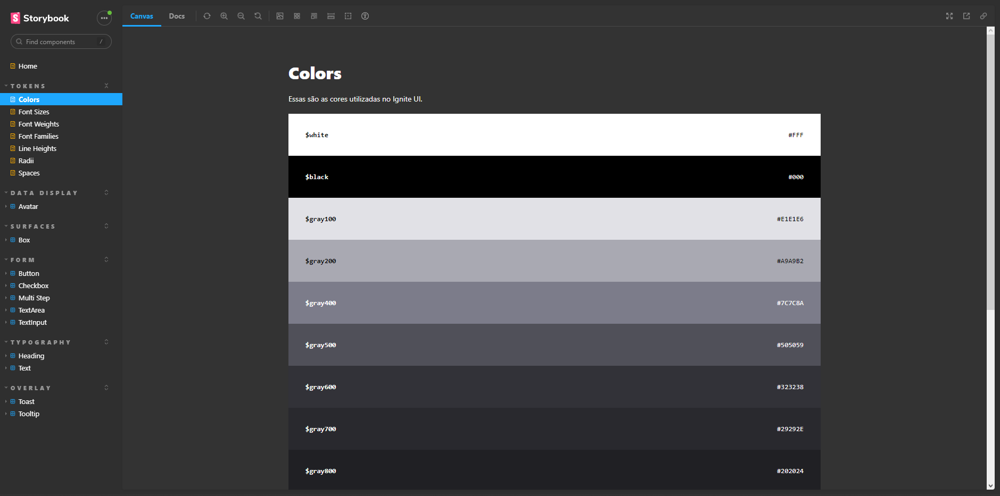

    

## :computer: Projeto

Este projeto foi feito durante o Projeto 05 do Ignite da Rocketseat, onde pude construir um design system completo com vários componentes e estados diferentes utilizando Storybook, e além disso, fiz a publicação da documentação no Github Pages e a publicação dos pacotes no npm.

- [Link do projeto](https://erik-ferreira.github.io/05-design-system/?path=/story/home--page)
- [@erik-ignite-ui/tokens](https://www.npmjs.com/package/@erik-ignite-ui/tokens)
- [@erik-ignite-ui/docs](https://www.npmjs.com/package/@erik-ignite-ui/docs)
- [@erik-ignite-ui/react](https://www.npmjs.com/package/@erik-ignite-ui/react)

## :rocket: Tecnologias

- [React](https://reactjs.org)
- [Typescript](https://www.typescriptlang.org)
- [Stitches JS](stitches.dev)
- [Storybook](https://storybook.js.org)
- [Turbo Repo](https://turbo.build)
- [Tsup](https://tsup.egoist.dev)
- [Radix Ui Components](https://www.radix-ui.com)

## :thinking: Como rodar o projeto?

1. Execute `npm i` para instalar as dependências

2. Execute `npm run dev` para rodar o projeto
